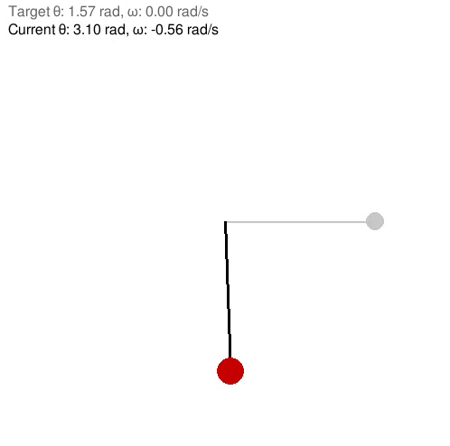
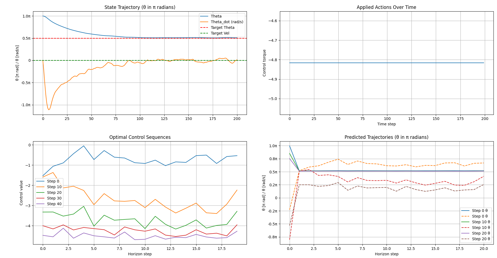

## Vanilla MPPI for Pendulum

$$
\ddot{\theta} = -\frac{g}{L} \sin(\theta) - \frac{b}{m L^2} \dot{\theta} + \frac{1}{m L^2} u
$$

where:
- $\theta$: Angle (rad) from the downward equilibrium.
- $\dot{\theta}$: Angular velocity (rad/s).
- $u$: Torque input (N·m).
- $m$: Mass of the pendulum bob (kg).
- $L$: Length of the rod (m).
- $b$: Damping coefficient (N·m·s/rad).
- $g$: Gravitational acceleration ($9.81 \, \text{m/s}^2$).

### Discretized Dynamics (Euler Method)
Using a timestep $\Delta t$, the discrete-time dynamics (state-space representation) are:

$$
\begin{aligned}
\theta_{k+1} &= \theta_k + \Delta t \cdot \dot{\theta}_k \\
\dot{\theta}_{k+1} &= \dot{\theta}_k + \Delta t \cdot \left( -\frac{g}{L} \sin(\theta_k) - \frac{b}{m L^2} \dot{\theta}_k + \frac{u_k}{m L^2} \right)
\end{aligned}
$$

### State-Space Form
Define the state vector $\mathbf{x}_k = [\theta_k, \dot{\theta}_k]^T$ and control input $u_k$. The discrete dynamics become:

$$
\mathbf{x}_{k+1} = f(\mathbf{x}_k, u_k) = 
\begin{bmatrix}
\theta_k + \Delta t \cdot \dot{\theta}_k \\
\dot{\theta}_k + \Delta t \cdot \left( -\frac{g}{L} \sin(\theta_k) - \frac{b}{m L^2} \dot{\theta}_k + \frac{u_k}{m L^2} \right)
\end{bmatrix}
$$

